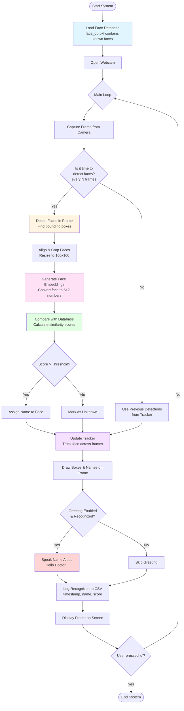
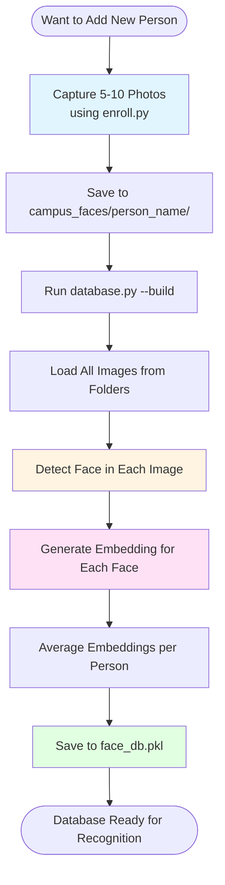

# 🎭 Face Recognition M4 (Apple Silicon Optimized)

[](https://www.python.org/)
[](https://pytorch.org/)
[](LICENSE)

A complete, production-ready real-time face recognition system optimized for **Apple Silicon (M1/M2/M4)** using PyTorch MPS backend. Features detection, recognition, tracking, TTS greetings, and enrollment tools.

---

## 🏗️ System Architecture

### How It Works - Complete Workflow



### Enrollment & Database Building Workflow



### 📋 Step-by-Step Process Explained

**Phase 1: System Initialization**
1. Load `face_db.pkl` → Database contains known faces (name + 512 numbers per person)
2. Open webcam → Start capturing video frames
3. Initialize tracker → Remembers faces across frames

**Phase 2: Per-Frame Processing (repeats every frame)**
1. **Capture frame** from webcam
2. **Check counter**: Should we detect faces now?
   - If YES (every 3rd frame): Run detection
   - If NO: Use previous detection from tracker
3. **Detection** (if triggered):
   - Find all faces in frame → Get bounding boxes
   - Crop and align each face → Resize to 160×160 pixels
   - Generate embedding → Convert face to 512 numbers
4. **Recognition**:
   - Compare embedding with database → Calculate similarity
   - If similarity > threshold: Assign person's name
   - If similarity < threshold: Mark as "Unknown"
5. **Tracking**:
   - Assign unique ID to each face
   - Smooth bounding box positions
   - Remember name for each tracked face
6. **Output**:
   - Draw boxes and names on frame
   - If greeting enabled + recognized → Speak name
   - Log to CSV file
7. **Display** frame on screen
8. **Check** if user pressed 'q' → Exit or continue loop

**Phase 3: Database Building (one-time setup)**
1. Capture 5-10 photos of each person → Save to `campus_faces/name/`
2. Run `database.py --build`:
   - Load all images
   - Detect face in each image
   - Generate embedding for each face
   - Average embeddings per person
   - Save to `face_db.pkl`
3. Database ready → Can now recognize these people

### 🔑 Key Concepts

- **Embedding**: A face converted to 512 numbers (like a fingerprint)
- **Similarity Score**: How similar two embeddings are (0-1, higher = more similar)
- **Threshold**: Minimum similarity to consider a match (default: 0.6)
- **Tracker**: Remembers faces across frames so we don't detect every frame
- **Detection Interval**: Run detection every N frames (saves processing time)

### 🛠️ Technologies Used

| Component | Technology | Purpose |
|-----------|-----------|---------|
| Face Detection | MTCNN | Finds faces in images |
| Face Embedding | InceptionResnetV1 / MobileFaceNet | Converts face to 512 numbers |
| Similarity | Cosine Similarity | Compares embeddings |
| Tracking | IOU Tracker | Follows faces across frames |
| Acceleration | PyTorch MPS | Uses Apple Silicon GPU |
| TTS | macOS `say` | Speaks recognized names |

---

## 📁 Project Structure

```
face_recognition_m4/
├── src/
│   ├── detector.py          # 🔍 MTCNN detection + alignment (facenet-pytorch)
│   ├── embedder.py          # 🧠 InceptionResnetV1 / MobileFaceNet embeddings
│   ├── database.py          # 💾 Build/load face database (pickle)
│   ├── recognizer.py        # 🎯 Cosine similarity matching
│   ├── tracker.py           # 📍 IOU tracker with EMA smoothing
│   ├── realtime.py          # ▶️ Main real-time demo loop
│   ├── enroll.py            # 📸 Interactive enrollment helper
│   └── utils.py             # 🛠️ Utilities (drawing, resizing)
├── campus_faces/            # 👥 Training images directory
├── face_db.pkl              # 💾 Embedding database
├── recognitions.csv         # 📊 Recognition logs
├── requirements-m4.txt      # 📦 Dependencies
├── ARCHITECTURE.md          # 📐 Detailed architecture docs
└── README.md                # 📖 This file
```

---

---

## 🚀 Quick Start (MacBook Air M4)

### 1️⃣ Install Miniforge (Recommended)

Download and install [Miniforge](https://github.com/conda-forge/miniforge/releases):

```bash
# Create conda environment
conda create -n face-rec-m4 python=3.11 -y
conda activate face-rec-m4
```

### 2️⃣ Install PyTorch with MPS Support

**Option A: Conda (Recommended)**
```bash
conda install pytorch torchvision -c pytorch -c conda-forge
```

**Option B: Pip**
```bash
pip install torch torchvision --extra-index-url https://download.pytorch.org/whl/cpu
```

### 3️⃣ Install Dependencies

```bash
pip install -r requirements-m4.txt
```

**For OpenCV issues:**
```bash
# If pip fails, use conda
conda install -c conda-forge opencv
```

### 4️⃣ Enroll People

**Option A: Use enrollment helper**
```bash
python src/enroll.py --id john_doe --count 10
```

**Option B: Manually add images**
```
campus_faces/
├── john_doe/
│   ├── 1.jpg
│   ├── 2.jpg
│   └── 3.jpg
└── jane_smith/
    ├── 1.jpg
    └── 2.jpg
```

### 5️⃣ Build Database

```bash
python src/database.py --build --faces-dir campus_faces --out face_db.pkl
```

### 6️⃣ Run Real-Time Demo

```bash
# Basic usage
python src/realtime.py --db face_db.pkl

# With all features
python src/realtime.py --db face_db.pkl --greet --embedder mobileface --detect-every 3
```

**Press `q` to quit the demo.**

---

## ⚙️ Configuration Options

| Flag | Description | Default |
|------|-------------|---------|
| `--db` | Path to face database | `face_db.pkl` |
| `--device` | Embedding device (`mps`/`cpu`) | `mps` |
| `--detection-device` | Detection device | Same as `--device` |
| `--embedder` | Model (`resnet`/`mobileface`) | `resnet` |
| `--detect-every` | Run detection every N frames | `3` |
| `--threshold` | Recognition threshold (0-1) | `0.6` |
| `--greet` | Enable TTS greetings | `False` |
| `--greet-threshold` | Min score for greeting | `0.6` |
| `--greet-interval` | Seconds between greetings | `6.0` |
| `--smoothing-alpha` | Tracker smoothing (0-1) | `0.6` |
| `--pad-mult` | MPS padding multiple | `64` |
| `--width` | Frame width for detection | `640` |

---

## 🎯 Performance Tuning

### Increase FPS
- ⬆️ Increase `--detect-every` (e.g., `5` or `7`)
- ⬇️ Reduce `--width` (e.g., `480` or `320`)
- 🏃 Use `--embedder mobileface` (faster, slightly lower accuracy)

### Improve Accuracy
- ⬇️ Lower `--threshold` (e.g., `0.5` for more permissive matching)
- 📸 Add more training images per person (5-10 recommended)
- 🎨 Ensure good lighting and frontal faces in training images

### Expected Performance (M4)
- **Detection**: 50-100ms per frame (MPS)
- **Embedding**: 10-20ms per face (MPS)
- **Overall FPS**: 20-30 FPS (1-2 faces)

---

---

## 🛠️ Troubleshooting

### ❌ "torch.backends.mps is not available"
**Solution:** Install PyTorch with MPS support
```bash
conda install pytorch torchvision -c pytorch -c conda-forge
```

Verify MPS availability:
```bash
python -c "import torch; print('MPS Available:', torch.backends.mps.is_available())"
```

### ❌ OpenCV import errors
**Solution:** Install via conda
```bash
conda install -c conda-forge opencv
```

### ❌ "No faces found" during database build
**Solutions:**
- Ensure images have clear, frontal faces
- Check image quality and lighting
- Try different images (webcam captures work well)
- Images are automatically resized if too large

### ❌ Low recognition accuracy
**Solutions:**
- Add more training images per person (5-10 recommended)
- Lower `--threshold` (e.g., `0.5`)
- Use better quality enrollment images
- Ensure consistent lighting conditions

### ❌ Low FPS / Performance
**Solutions:**
- Increase `--detect-every` to `5` or `7`
- Reduce `--width` to `480`
- Use `--embedder mobileface`
- Force CPU detection: `--detection-device cpu`

---

## 📚 Technical Details

### Technologies Used
- **Detection**: MTCNN (facenet-pytorch)
- **Embedding**: InceptionResnetV1 (VGGFace2) / MobileFaceNet
- **Matching**: Cosine Similarity
- **Tracking**: IOU-based tracker with EMA smoothing
- **Backend**: PyTorch MPS (Metal Performance Shaders)
- **TTS**: macOS `say` command (with pronunciation fixes)

### Why Not DeepFace?
We chose **facenet-pytorch** over DeepFace because:
- ✅ Better optimized for Apple Silicon (PyTorch MPS)
- ✅ Lighter installation (no TensorFlow dependency)
- ✅ Faster performance on Mac M4
- ✅ More control over detection/embedding pipeline

DeepFace requires TensorFlow + TensorFlow-Metal, which is heavier and can be harder to configure on macOS.

### Linux Compatibility
✅ **Yes**, this system works on Linux with minimal changes:
- Core detection, embedding, tracking work as-is
- For TTS on Linux: replace macOS `say` with `espeak` or `pyttsx3`
- For GPU: use CUDA-enabled PyTorch instead of MPS

---

## 📖 Usage Examples

### Example 1: Basic Recognition
```bash
python src/realtime.py --db face_db.pkl
```

### Example 2: With TTS Greetings
```bash
python src/realtime.py --db face_db.pkl --greet --greet-threshold 0.5
```

### Example 3: High Performance Mode
```bash
python src/realtime.py --db face_db.pkl --embedder mobileface --detect-every 5 --width 480
```

### Example 4: High Accuracy Mode
```bash
python src/realtime.py --db face_db.pkl --detect-every 2 --threshold 0.7
```

### Example 5: CPU-Only (Fallback)
```bash
python src/realtime.py --db face_db.pkl --device cpu --detection-device cpu
```

---

## 📊 Database Management

### Check Database Contents
```bash
python -c "import pickle; db = pickle.load(open('face_db.pkl', 'rb')); print('People:', list(db.keys()))"
```

### Rebuild Database After Adding People
```bash
python src/database.py --build --faces-dir campus_faces --out face_db.pkl
```

### View Recognition Logs
```bash
cat recognitions.csv
```

---

## 🎓 Credits & References

- **MTCNN**: [facenet-pytorch](https://github.com/timesler/facenet-pytorch)
- **InceptionResnetV1**: Trained on VGGFace2 dataset
- **PyTorch**: [Apple Metal Performance Shaders](https://pytorch.org/docs/stable/notes/mps.html)

---

## 📝 License

MIT License - feel free to use in your projects!

---

## 🤝 Contributing

Issues and pull requests welcome! For major changes, please open an issue first.

---

**Built with ❤️ for Apple Silicon (M4) by Koushik**
